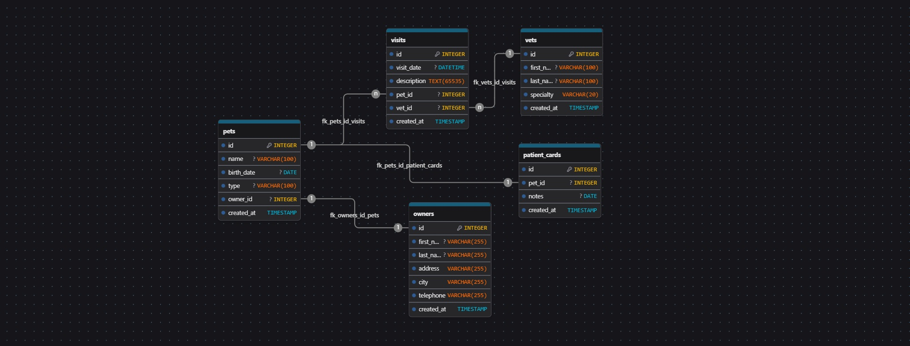

# Ветеринарная Клиника. Задание от Северстали.

Crud веб-приложение "Ветеринарная клиника".

## Технологии

### Backend
- Java использовал с фреймворком Javalin
- PostgreSQL - база данных
- Maven - система сборки

### Frontend
- React
- React Router - навигация
- Axios - HTTP клиент

### Инфраструктура
- Docker и Docker Compose
- Nginx - веб-сервер для frontend

## Функциональность

### Сущности:
Создал 5 основных сущностей 
1. Owners - Владельцы питомцев
2. Pets - Питомцы
3. Vets - Ветеринары
4. Visits - Визиты (записи на приём)
5. PatientCard - Карточки пациентов

### CRUD операции:
- Реализовал создание, просмотр, редактирование и удаление всех сущностей

### Связи между сущностями:
- Карточка пациента -> питомец (1 к 1, у одного питомца одна карточка)
- Ветеринар -> визиты (1 ко многим, к одному врачу может быть несколько визитов)
- Питомец -> владелец (1 к 1, у одного питомца 1 владелец)
- Питомец -> визит (1 ко многим, у одного питомца может быть несколько )

## Запуск проекта

### Требования для запуска
- Docker
- Docker Compose
- wsl для Windows (Без него не запустятся контейнеры)
### Быстрый старт

1. Клонируйте репозиторий и перейдите в папку с проектом:


2. Запустите все сервисы одной командой:

```bash
docker-compose up --build
```

или

```bash
make up
```
Эта команда:
- Создаст и запустит PostgreSQL контейнер
- Соберёт и запустит контейнер с Java backend 
- Соберёт и запустит контейнер с React frontend


3. Откройте браузер:
- http://localhost:3000


### Остановка сервисов

```bash
docker-compose down
```

Для удаления внесенных Вами данных из БД:
```bash
docker-compose down -v
```
## Структура БД

Ссылка на моделирование структуры: https://drawdb.vercel.app/editor?shareId=46bfb06c00a9e121a6ed231980cd787f

### Схема:
- owners: id, firstname, lastname, address, city, telephone, createdAt
- pets: id, name, birthdate, type, ownerid, createdAt
- vets: id, first_name, last_name, specialty, createdAt
- visits: id, visit_date, description, petid, vetid,createdAt
- patient_card: id, pet_Id, notes, createdAt

## Эндпоинты

### Owner
- `GET /api/owners` - Получить всех владельцев
- `GET /api/owners/{id}` - Получить владельца по ID
- `POST /api/owners` - Создать владельца
- `PUT /api/owners/{id}` - Обновить владельца
- `DELETE /api/owners/{id}` - Удалить владельца

### Pet
- `GET /api/pets` - Получить всех питомцев
- `GET /api/pets?ownerId={id}` - Получить питомцев владельца
- `GET /api/pets/{id}` - Получить питомца по ID
- `POST /api/pets` - Создать питомца
- `PUT /api/pets/{id}` - Обновить питомца
- `DELETE /api/pets/{id}` - Удалить питомца

### Vet
- `GET /api/vets` - Получить всех ветеринаров
- `GET /api/vets/{id}` - Получить ветеринара по ID
- `POST /api/vets` - Создать ветеринара
- `PUT /api/vets/{id}` - Обновить ветеринара
- `DELETE /api/vets/{id}` - Удалить ветеринара

### Visit
- `GET /api/visits` - Получить все визиты
- `get /api/visits?petId={id}` - Получить визиты питомца
- `GET /api/visits/{id}` - Получить визит по ID
- `POST /api/visits` - Создать визит
- `PUT /api/visits/{id}` - Обновить визит
- `DELETE /api/visits/{id}` - Удалить визит

### PatientCard
- `GET /api/patient-cards` - Получить все карты 
- `GET /api/patient-cards/{id}` - Получить карты пациента
- `POST /api/patient-cards"` - Создать карту пациента
- `put /api/patient-cards/{id}"` - Обновить карту пациента
- `delete /api/patient-cards/{id}"` - Удалить карту пациента

### Тестовые данные:
При первом запуске автоматически создаются тестовые данные:
- 3 владельца
- 3 ветеринара
- 4 питомца
- 3 визита


## Преимущества решения

1. Скорость - Javalin быстрее и легче Spring Boot. Впервые использовал, для таких мини-проектов очень удобный вариант.
2. Полная изоляция - все основные функциональности вынес в отдельные контейнеры.
3. Интерфейс - простой и дружелюбный UI.

## Что в дальнейшем я мог бы добавить или улучшить?

- Добавить валидацию данных
- Добавить поиск и фильтрацию
- Добавить аутентификацию
- Добавить тестирование


